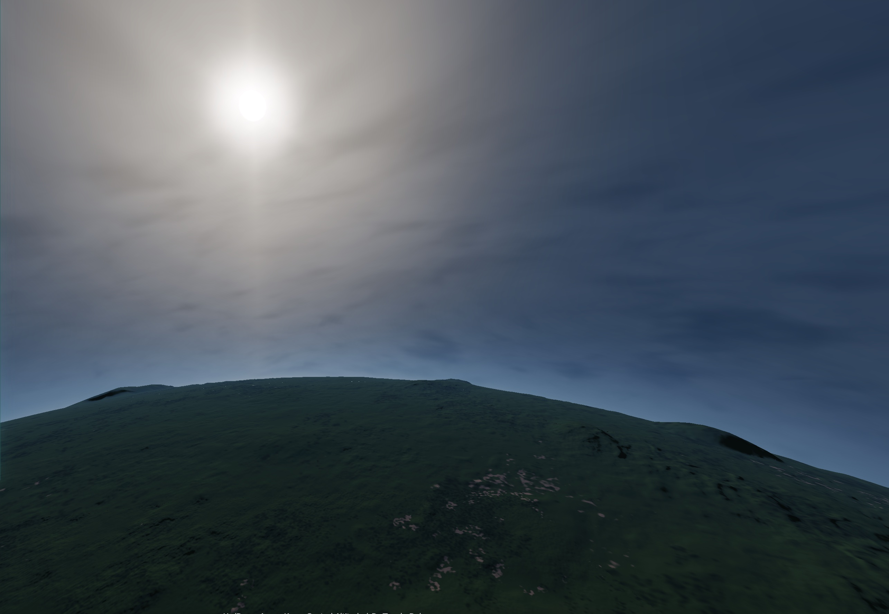
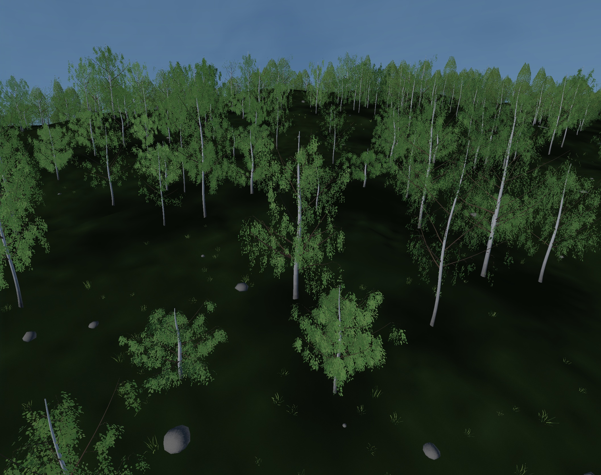
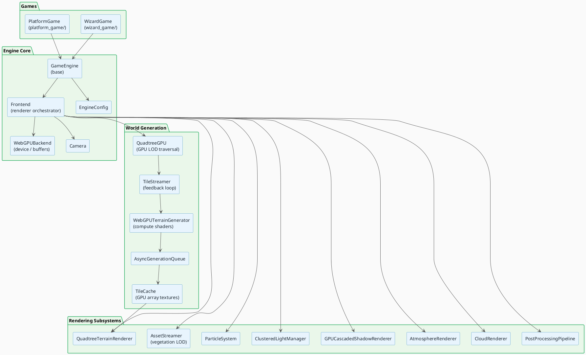
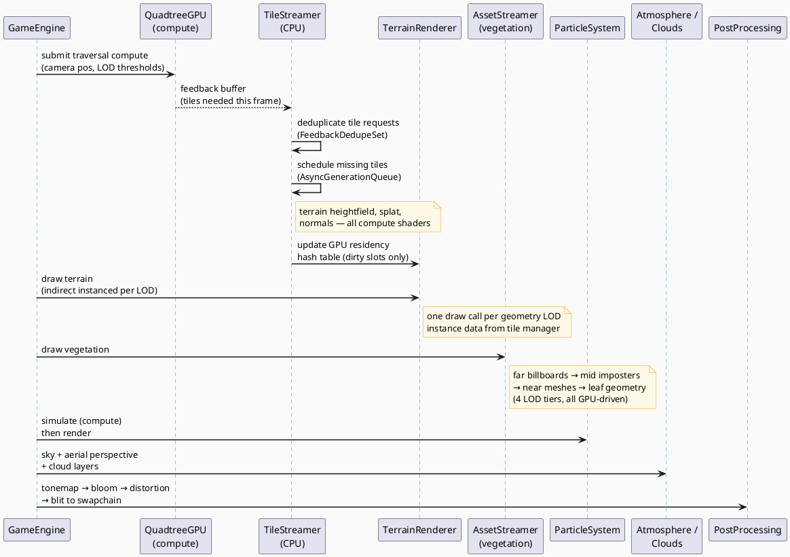
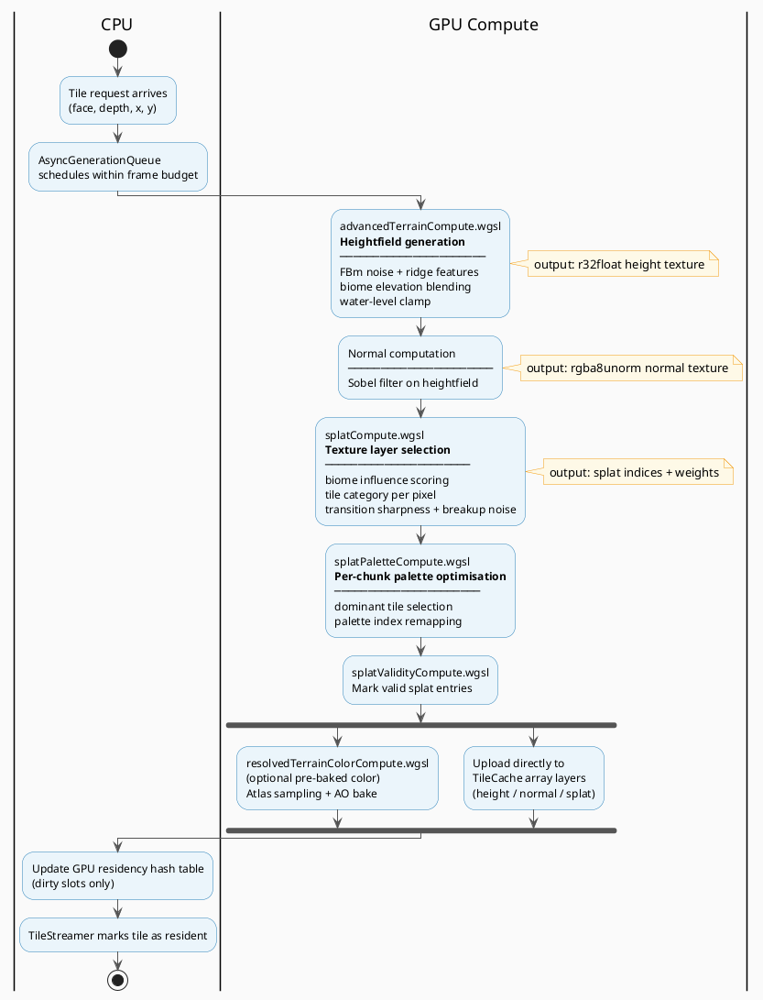
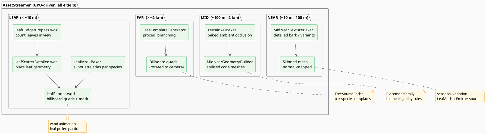

# spherecraft

A procedural WebGPU planet engine with real-time terrain streaming, physically-based atmosphere, GPU-driven vegetation LOD, and two playable game modes — built entirely from scratch without Three.js or Babylon.js.

> **Requires a WebGPU-capable browser.** Chrome 113+ or Edge 113+ on desktop is recommended.





---

## Features

**Terrain & World**
- Cube-sphere planet geometry with GPU quadtree LOD — tiles stream in/out based on view distance, driven by a per-frame GPU feedback buffer
- All terrain heightfields, splat maps, and normals generated on the GPU via WGSL compute shaders
- Per-biome texture splatting with palette optimisation and transition blending
- Procedural noise library (FBm, ridges, domain warping) driving terrain features: continents, plains, hills, mountains, canyons

**Rendering**
- Clustered forward lighting — point/spot lights assigned to 3-D view-space clusters in a compute pass, zero overdraw from light sorting
- Cascaded shadow maps (3 cascades, depth-only passes)
- Physically-based atmospheric scattering — precomputed transmittance and multi-scatter LUTs, aerial perspective, twilight transitions
- Volumetric cloud layers (low/mid/high altitude) simulated and rendered via compute passes
- Post-processing pipeline: HDR tonemapping, dual-threshold bloom, heat-haze screen distortion

**Vegetation**
- GPU-driven 4-tier vegetation LOD: **far billboards → mid imposters → near meshes → full leaf geometry**
- Leaf budget prepass limits overdraw; leaf mask atlas baked per species
- Ambient occlusion baked per terrain chunk; seasonal variation support

**Characters & Physics**
- Skinned mesh renderer for rigged GLB characters
- GPU movement resolver compute shader for character physics
- Platform collision system

**Particles**
- GPU particle system: campfire sparks, firefly swarms, weather rain, pollen/dust
- Simulation and rendering in separate compute/render passes
- Emitters can follow world actors

---

## Getting started

```bash
# clone
git clone <repo-url>
cd spherecraft

# serve with no-cache headers (required for ES modules)
python3 server.py
# → http://localhost:8000

# or use any static file server, e.g.:
npx serve .
```

Open `http://localhost:8000` in Chrome 113+ or Edge 113+. The engine boots with the wizard-game world by default. The platform game is at `platform_game/standalone.html`.

```bash
# lint
npm run lint

# lint with auto-fix
npm run lint:fix

# tests (vitest)
npm test
```

---

## Architecture

> Diagrams below use PlantUML. Render them with the [PlantUML VS Code extension](https://marketplace.visualstudio.com/items?itemName=jebbs.plantuml) or paste into [plantuml.com/plantuml](https://www.plantuml.com/plantuml/uml/).

### High-level components



---

### Per-frame render pipeline



---

### Terrain generation pipeline



---

### Vegetation LOD chain



---

## Project structure

```
spherecraft/
├── core/
│   ├── Camera.js
│   ├── EngineConfig.js
│   ├── actors/              # GPU movement resolver, collision
│   ├── atmosphere/          # Transmittance + multi-scatter LUTs
│   ├── lighting/            # Clustered light manager, uniform manager
│   ├── mesh/                # Chunk load queue, geometry builders
│   ├── planet/              # Cube-sphere maths, quadtree traversal
│   ├── renderer/
│   │   ├── atmosphere/      # WebGPU sky renderer, aerial perspective
│   │   ├── atmosphere-banks/# Volumetric cloud/aerosol particle banks
│   │   ├── backend/         # WebGPU device, buffer management
│   │   ├── clouds/          # Cloud noise generator + renderer
│   │   ├── environment/     # Weather controller
│   │   ├── frontend/        # Render-loop orchestrator
│   │   ├── mesh/            # Skinned mesh renderer
│   │   ├── particles/       # GPU particle sim + render passes
│   │   ├── postprocessing/  # Bloom, tonemapping, distortion
│   │   ├── resources/       # Geometry, material, texture, render-target
│   │   ├── streamer/        # 4-tier vegetation LOD system
│   │   ├── terrain/         # Quadtree terrain renderer
│   │   └── water/           # Ocean renderer
│   ├── shadows/             # Cascaded shadow map renderer
│   ├── texture/             # Mipmap gen, texture manager, tile limits
│   └── world/
│       ├── quadtree/        # GPU quadtree traversal, tile cache, streamer
│       ├── shaders/webgpu/  # Terrain compute shaders (WGSL)
│       └── webgpuTerrainGenerator.js
├── templates/
│   ├── configs/             # Planet, atmosphere, tile, particle configs
│   ├── features/            # Terrain feature builders (hills, mountains …)
│   └── streamer/            # Asset archetypes, placement families
├── shared/                  # Logger, math utilities
├── wizard_game/             # RPG-style exploration game
├── platform_game/           # Platformer using cloud platforms
├── assets/                  # GLB character models
├── screenshots/
├── tools/                   # Debug panels, test suites
├── server.py                # Dev server (no-cache headers)
├── eslint.config.mjs
└── vitest.config.mjs
```

---

## Tech stack

| Layer | Technology |
|---|---|
| GPU API | WebGPU (no abstraction layer) |
| Shaders | WGSL (compute, vertex, fragment) |
| Language | JavaScript ES2022 modules |
| Linting | ESLint 9 (flat config) |
| Testing | Vitest 3 |
| CI | GitHub Actions — CodeQL, static analysis, LLM PR review |
| Runtime deps | **none** — no Three.js, Babylon.js, or any 3-D framework |

---

## Browser compatibility

WebGPU is required. As of 2025, the following browsers support it on desktop:

- **Chrome / Chromium 113+**
- **Edge 113+**
- **Safari 18+** (macOS Sequoia / iOS 18, behind a flag on some versions)

Firefox does not yet support WebGPU by default.

---

## License

[MIT](LICENSE)
